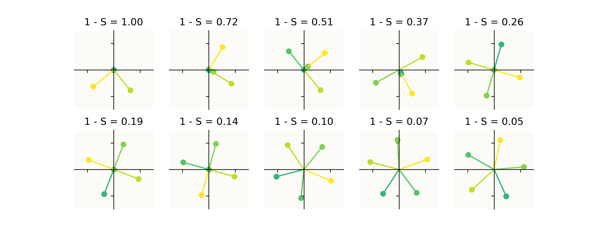
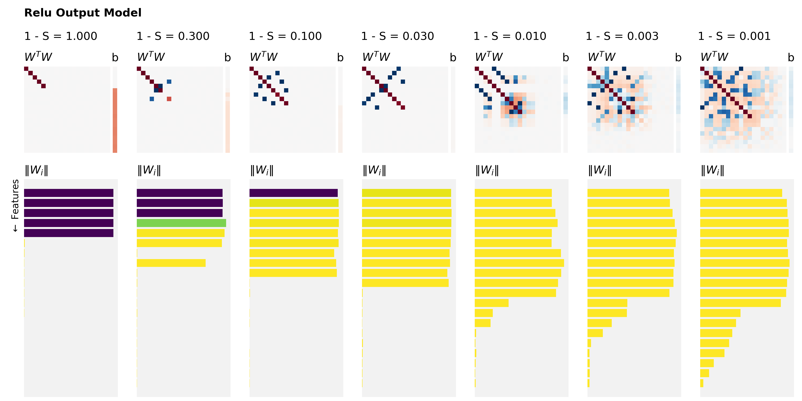
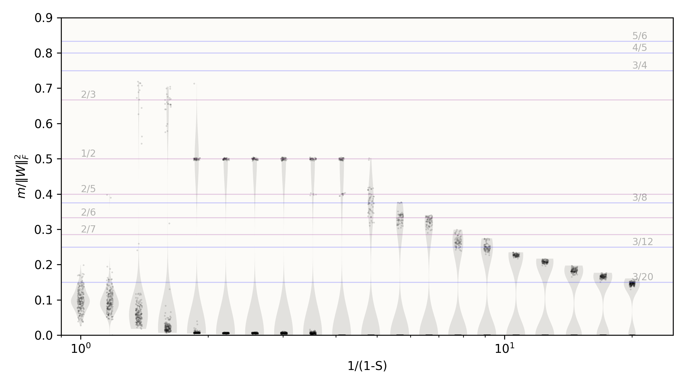

# Toy Models of Superposition: Replication in JAX

This repository contains a replication of Anthropic's "Toy Models of Superposition" in JAX [^1][^2].

I made the JAX implementation a bit more scalable and flexible than a single notebook. This includes:

- Single entry `make.py` file to run the toy experiments and plotting figures
- Experiments can be configured in `.toml` files contaiend in `config`
- Running the experiments and plotting the results are separate steps
- The fitted toy models are store in `safetensors` format in the `results` folder


## Getting Started

I would recommend to use `uv`, which will automatically detect the `uv.lock` file and create and reproducible environment.

To reproduce the figures below you can then use:

```bash
uv run make.py train --config configs/intro-figure.toml
uv run make.py plot --config configs/intro-figure.toml --plot-type intro
```

```bash
uv run make.py train --config configs/varying-sparsity.toml
uv run make.py plot --config configs/varying-sparsity.toml --plot-type superposition
```

```bash
uv run make.py train --config configs/feature-geometry.toml
uv run make.py plot --config configs/feature-geometry.toml --plot-type feature-geometry
```

## Results

I can basically exactly(!) reproduce the figures shown in [^1]:

### Intro Figure



### Superposition




### Feature Dimensionality



## References

[^1]: https://transformer-circuits.pub/2022/toy_model/index.html
[^2]: https://github.com/anthropics/toy-models-of-superposition/tree/main
